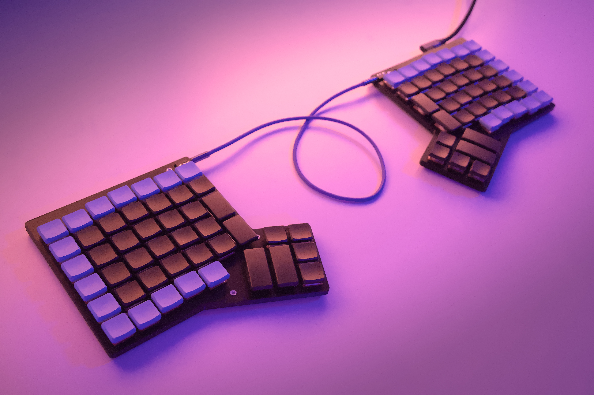

# ExtraDox (v2)

The ExtraDox is a split keyboard based off the ErgoDox. The main difference is
that it has an additional row of keys on the top. Also, it is a low-profile
keyboard designed for Choc v2 switches.

It features:

- An additional row of keys over the ErgoDox
- An USB-C port
- A single-board design (actually two boards), no extra controller board
- A TRRS connection between the two sides
- The 3 usual status LED
- The case is only 8mm thick, the keys are 18mm high from the desk

## Buying one

I have a few extra boards to sell, contact me if you are interested.

## What you need to build this keyboard

- The PCBs and their components (the MCU is soldered on the main board)
- The 3D-printed case
- 14x M2.5x8 screws and nuts
- 10x rubber pads to put under the keyboard to prevent slipping
- 90x Kailh Choc Hotswap sockets
- 90x Kailh Choc switches
- 82x 1u key caps
- 4x 1.5u key caps
- 4x 2u key caps
- 3x SMD status LED (see the Kicad project for details)
- 2x TRRS connector (see the Kicad project for details)
- 1x TRRS cable
- 1x USB-c cable

## About this keyboard

### PCB

The PCB is designed in Kicad. It is a SMD design and the project includes
component references from JLCPCB.

### Case

The case is designed to be 3D-printed. The case is screwed together with 7
M2.5x8 screws on each side, and their corresponding bolts.

### Firmware

[Here](https://github.com/blastrock/qmk_firmware/tree/extradox/keyboards/extradox) is a a fork of the QMK firmware with support for the ExtraDox.

## Known issues

Some capacitors are located right under an hotswap socket. It is still possible
to solder it, but the socket gets a little tilted.

## License

This work is licensed under a [Creative Commons Attribution-NonCommercial-ShareAlike 4.0 International License](http://creativecommons.org/licenses/by-nc-sa/4.0/).
